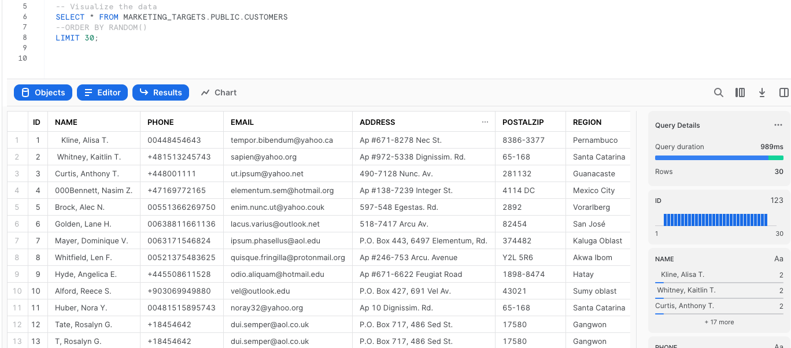
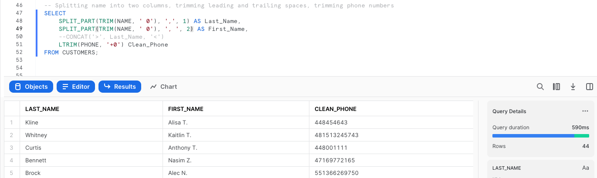
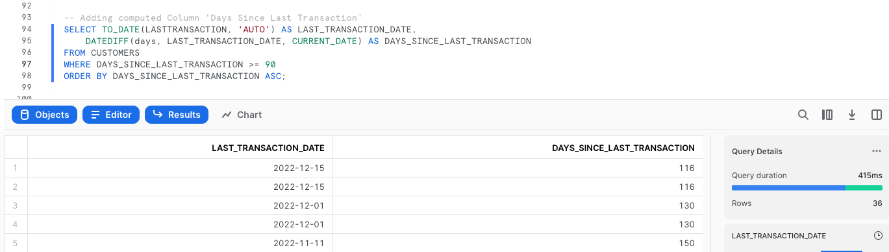
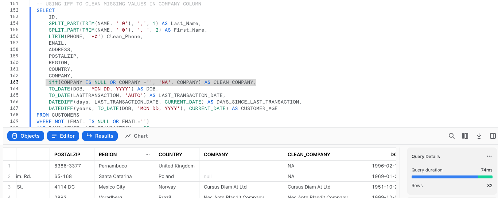
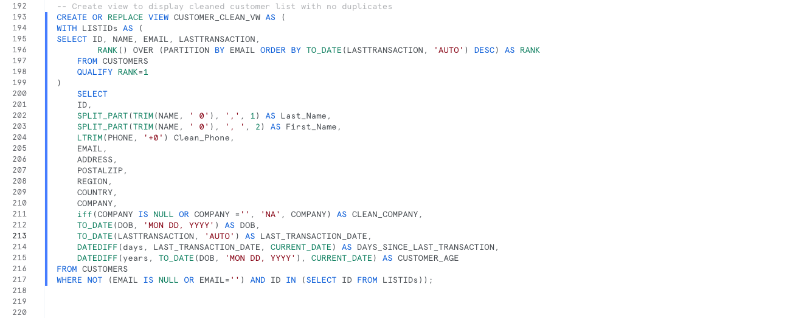

# Marketing-Data-ETL

Using Snowflake and SQL, the goal of this exercise was to identify somewhat disengaged customers for a targeted marketing effort. Disengaged customers where defined as those who had not completed a transaction in the last 90 days. Before the data could be queried however, it needed to be cleaned. Upon initial investigation, there were may NULL values, duplicates, and a range of formatting inconsistencies for names, phone numbers, zip codes, etc. 

#### Trimming leading and trailing spaces, standardizing Phone numbers, and splitting names into two collumns

#### Adding a computed collumn to display last transaction

#### Cleaning Company info collumn by replacing missing or NULL values with NA

#### Putting all the column cleaning steps together into one query and creating a view. This will provide a complete list of clean customer data as well as a table view that can be filtered based on desired parameters. 

